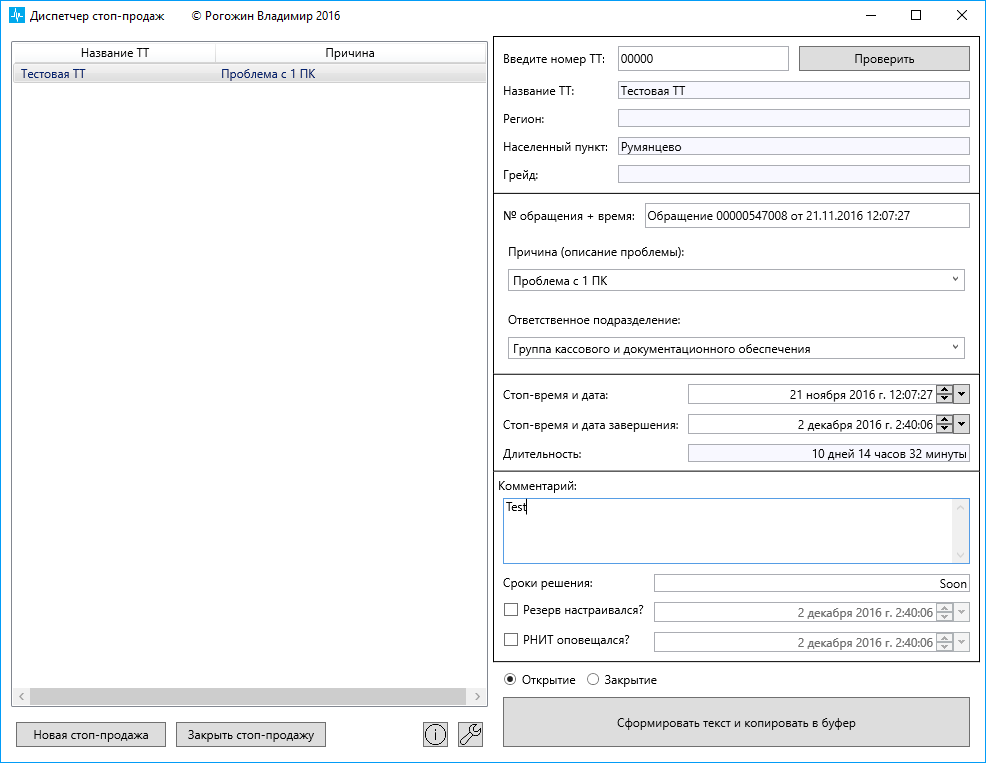
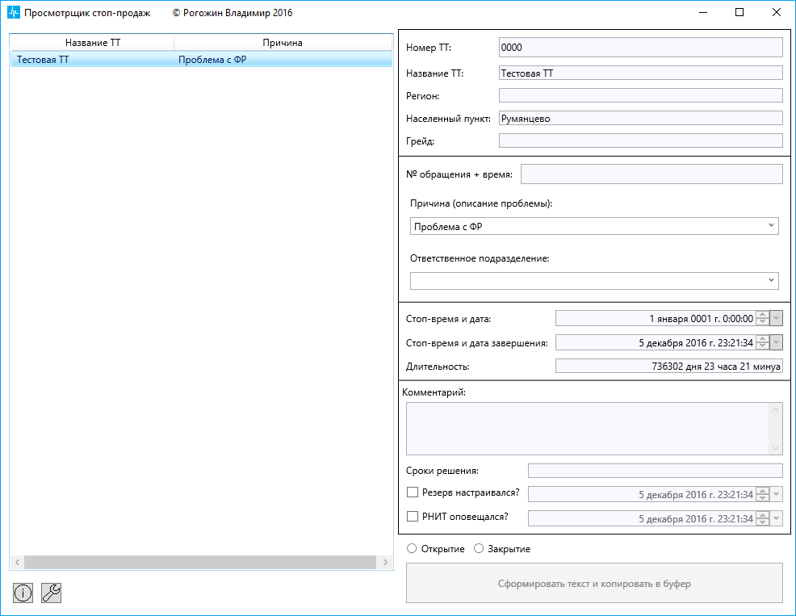
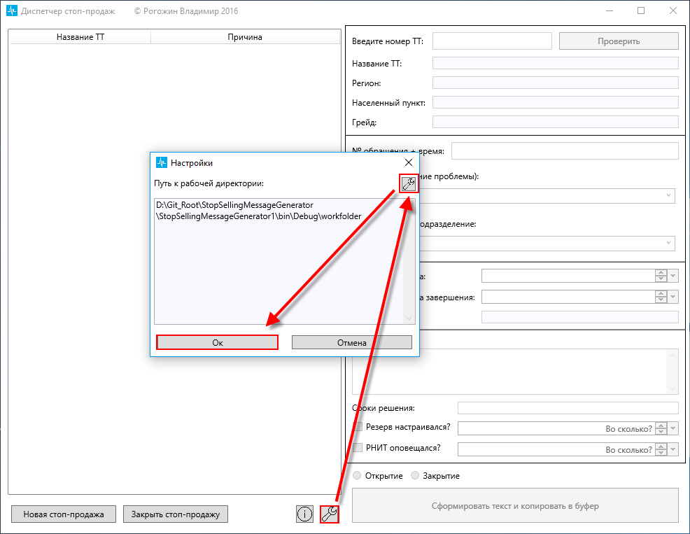
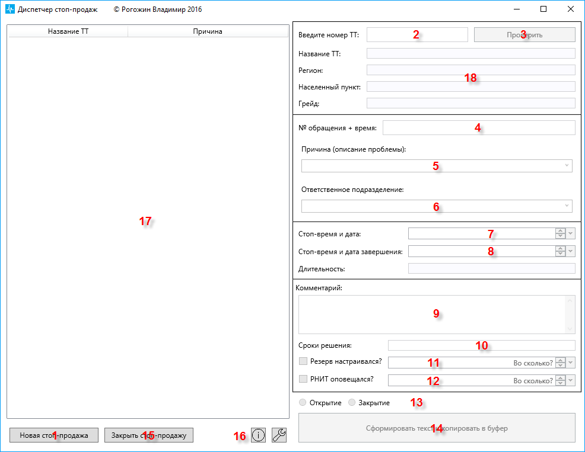

# Диспетчер стоп-продаж

### Программа предназначена для упрощения работы с текущими стоп-продажами, генерации сообщений на основе шаблонов, автоматического экспорта данных о закрытых стоп-продажах в CSV файл.



----------

## **[Инструкция администратора](#AdminManual)**
##### [Подготовка к работе](#GettingStartedAdmin)
##### [Макросы](#Macroses)
##### [Просмотр текущих стоп-продаж](#ViewStopSellings)
##### [Отчёт по стоп-продажам](#StopSellingsReport)
##### [Восстановление после сбоя](#RestoreAfterFailure)

## **[Инструкция пользователя](#UserManual)**
##### [Подготовка к работе](#GettingStartedUser)
##### [Добавление стоп-продажи](#AddStopSelling)
##### [Закрытие стоп-продажи](#CloseStopSelling)
##### [Возможные проблемы](#ProbablyProblems)

## **[Инструкция программиста](#ProgrammerManual)**
##### [Описание архитектуры проекта](#ProjectArchitecture)
##### [Добавление новых макросов](#AddNewMacroses)
##### [Возможные проблемы](#ProbablyProblemsProgrammer)

----------

## **Инструкция администратора** <a name="AdminManual"></a>  
#### Подготовка к работе <a name="GettingStartedAdmin"></a>
1. В выбранное расположение распаковать архив [WorkFolder](WorkFolder.zip).
2. Необходимо убедиться, что у всех пользователей есть права на запись в распакованную 
    в папку WorkFolder. 
3. В папку WorkFolder поместить выгрузку общего отчёта из NSI (Паспорта ТТ -> Отчеты ->
    Общий -> Сохранить как Таблица.txt (*Текстовый файл ANSI (Windows) (**.txt)*)).
    Отчет рекомендуется своевременно актуализировать.
    > В случае возникновения проблем с данными, полученными из отчёта, убедитесь, что 
    > файл сохранился в _Windows-1251_ кодировке.
4. Убедиться, что текст в файлах **open.txt** и **close.txt** в папке **WorkFolder** соответствует
    требуемому *(макросы, которые можно использовать в тексте приведены 
    в пункте [макросы](#Macroses))*.
    > Текст шаблона в файлах **open.txt** и **close.txt** рекомендуется размещать одной строкой.
    
    > Файлы  **open.txt** и **close.txt** должны быть сохранены в кодировке _UTF-8_.

    > В тексте можно размещать символы юникода, вставляя их шестнадцатеричные представления. 
    > Например: _\u26D4_ .

5. Убедится что в файле **output.txt** , который расположен в папке **WorkFolder**, задан
    корректный формат файла отчета. Формат строки задаётся с использованием [макросов](#Macroses).  
    *Рекомендуется* ограничится одной строкой в файле **output.txt** для 
    формирования корректного CSV отчета.

    > **Важно:** одновременный мониторинг стоп-продаж (с возможностью записи) возможен 
    > только одним пользователем! При завершении работы, программу необходимо закрыть! 

#### Список макросов    <a name="Macroses"></a>

* _%Region%_ - регион ТТ
* _%City%_ - Населённый пункте
* _%TTNumber%_ - код ТТ
* _%TTName%_ - название ТТ
* _%Greid%_ - грейд ТТ
* _%Reason%_ - причина стоп-продажи
* _%Reserve%_ - настраивался ли резерв на ТТ (Да/Нет)
* _%ReserveConfigureDateTime%_ - время настройки резерва
* _%StartStopSellingTime%_ - время возникновения стоп-продажи
* _%DurationStopSelling%_ - продолжительность стоп-продажи в днях, часах и минутах
                            (пример: *1 час 2 минуты 3 секунды*)
* _%DurationStopSellingInHoursAndMinutes%_ - продолжительность стоп-продажи в часах и минутах 
                                            (пример: *1:20*)
* _%Coments%_ - описание стоп-продажи
* _%ExpectedSolutionTime%_ - предполагаемое время решения окончания стоп-продажи
* _%Responsibility%_ - ответственный отдел
* _%RnitNotified%_ - оповещались ли региональные начальники ИТ (Да/Нет)
* _%RnitNotifiedTime%_ - время оповещения регионального начальника ИТ
* _%TimeToRnitNotified%_ - время до оповещения регионального начальника ИТ 
                        в днях, часах и минутах (пример: *1 час 2 минуты 3 секунды*)
* _%ObrashenieAndTimeStringAdapter%_ - номер обращения и с датой и временем 
                                    (пример: *Обращение 00000547008 от 21.11.2016 12:07:27*)
* _%ObrashenieNumber%_ - номер обращения
* _%StopStopSellingTime%_ - дата и время окончания стоп-продажи

> Даты выводятся в формате **dd.MM.yyyy HH:mm:ss** .
> Булевые типы выводятся как **Да** или **Нет** .

#### Просмотр текущих стоп-продаж <a name="ViewStopSellings"></a>



Для просмотра текущих стоп-продаж существует модификация диспетчера, которая не
производит запись в файловую систему, не мешает функционированию основной программы.

Для начала работы необходимо:
1. Установить  приложение с помощью ClickOnce установщика
2. Выбрать рабочую папку в настройках приложения 
    
3. Перезапустить программу

> Данные обновляются с интервалом в 3 минуты.

#### Отчёт по стоп-продажам <a name="StopSellingsReport"></a>

При закрытии стоп-продажи, она переносится в отчёт. Отчёт создаётся в рабочей папке
с именем **Report.csv**. В случае удаления/перемещения файла отчета закрытии следующей
стоп-продажи будет сформирован новый файл.

> Отчет формируется в кодировке _windows-1251_.

#### Восстановление после сбоя <a name="RestoreAfterFailure"></a>

> В случае сбоя достаточно удалить файы **StopSellings.dat** и **owner.txt** в рабочей папке.
> В данном случае все данные по текущим стоп-продажа будут **утеряны**.

## **Инструкция пользователя** <a name="UserManual"></a>
#### Подготовка к работе <a name="GettingStartedUser"></a>
1. Установить приложение с помощью ClickOnce установщика
2. Выбрать рабочую папку в настройках приложения 
    
3. Перезапустить программу

#### Добавление стоп-продажи <a name="AddStopSelling"></a>



Для добавления новой стоп-продажи необходимо:

1. Нажать на кнопку _Новая стоп-продажа_ **(1)**.
2. Ввести номер код ТТ в поле **2**.
3. Нажать на кнопку **3** для проверки кода. Поля в области **18** должны заполнится.
4. Вставить, скопированный из SSD, номер обращения с датой и временем в 
    поле **4** (например: _Обращение 00000597899 от 04.12.2016 12:46:53_).
5. Заполнить причину стоп-продажи **(5)**. В случае необходимости, можно вписать свою причину
    стоп-продажи. Причина автоматически сохранится для последующего использования.
6. Заполнить отвественное за стоп-продажу подразделение **(6)**. В случае необходимости, 
    можно вписать новое ответственное подразделение. Ответственное подразделение 
    автоматически сохранится для последующего использования.
7. При не обходимости скорректировать время начала стоп-продажи **(7)**. 
    > Дата начала стоп-продажи заполняется автоматически при заполнении поля **4**.
    
    > Дата и время завершения споп-продажи автоматически устанавливается текущим при
    > создании стоп-продажи, формировании сообщений.
    
    > Длительность стоп-продажи выщитывается автоматически.
8. Ввести комментарии в поле **9**.
9. Ввести сроки решения стоп-продажи в поле **10** (или указать _уточняется_).
10. Отметить в чекбоксы и указать время в полях **11** и **12**, если по проблеме с
    интернетом настраивался резерв, или производилось информирование РНИТ.
13. Выбрать _открытие_ **(13)**.
14. Сформировать текст сообщения **(14)**.
15. Вставить сформированное сообщение в Telegram, проверить корректность сообщения,
    отправить сообщение в группу.

#### Закрытие стоп-продажи <a name="CloseStopSelling"></a>

1. Выбать требуемую стоп-продажу **(17)**.
2. Скорректировать время и дату завершения стоп-продажи в поле **8**.
3. Проверить корректность всех данных **(2-12, 18)**. 
4. Выбрать _закрытие_ **(13)**.
5. Сформировать текст сообщения **(14)**.
6. Вставить сформированное сообщение в Telegram, проверить корректность сообщения,
    отправить сообщение в группу.

#### Возможные проблемы <a name="ProbablyProblems"></a>

>**Q**: Не удаётся закрыть стоп-продажу.
>>**A**: Проверьте, что файл отчета в рабочей папке доступен для записи и нигде не открыт.

## **Инструкция программиста** <a name="ProgrammerManual"></a>
#### Описание архитектуры проекта <a name="ProjectArchitecture"></a>

В качестве архитектурного паттерна в проекте используется паттерн MVVM.
В качестве MVVM фраймворка используется _Mugen MVVM Framework_.
Биндинги всех элементов (кроме некоторых кнопок) в главном view (_MainView_) сделаны 
сразу на свойства модели (_StopSelling_).
Главной viewmodel'и (_MainViewModel_) в конструкторе передаются ссылки на реализации
следующих интерфейсов:
* _IDataSource_ - предоставляет свойства и методы для сохранения и восстановления
                    состояния viewmodel'и
* _ITtInformationSource_ - позволяет получать список объектов, представляющих паспорта ТТ
* _IStopSellingsBulder_ - предоставляет метод для создания новых объектов **StopSelling**
* _IToastPresenter_ - предоставляет методы для показа всплывающих сообщений
                        (предоставляется MVVM фраймворком)
* _IMessageTextGenerator_ - предоствляет метод для генерации текста сообщений по шаблону 
* _IReportGenerator_ - предоствляет метод для генерации CSV отчета по шаблону
* _IWorkFolderOwnerChecker_ - предоставляет методы для определения занята ли рабочая
                        папка, а так же для установки себя в качестве владельца рабочей папки.
                        Позволяет проверить существует ли рабочая папка.

Зависимости разрешаются DI-контейнером Autofac, конфигурирование контейнера осуществляется
в классе _App_.

Для получения данных по ТТ из выгрузки используется библиотека FileHelpers

Логирование осуществляется с помощью NLOG. Логи пишутся по пути: 
"_%LOCALAPPDATA%/StopSellingsManager/Log/_".

#### Добавление новых макросов <a name="AddNewMacroses"></a>

Макросы можно добавить, реализовав дополнительные свойства в классе _StopSelling_.
Допускается использование свойств типов **string**, **DateTime** и **bool**.
Для автоматической вставки описания макроса в шапку отчёта, свойство должно быть помечено
атрибутом _FriendlyName_. Например:
```C#
[FriendlyName("Время до информирования РНИТ")]
public string TimeToRnitNotified
{
    get
    {
        if (!RnitNotified) return "";

        TimeSpan span = RnitNotifiedTime - StartStopSellingTime;
        StringBuilder stringBuilder = new StringBuilder();
        if (span.Days > 0)
        {
            stringBuilder.Append($"{span.Days} ");
            stringBuilder.Append(Helper.GetDeclension(span.Days, "день", "дня", "дней"));
        }
        if (span.Hours > 0)
        {
            if (stringBuilder.Length > 0) stringBuilder.Append(" ");
            stringBuilder.Append($"{span.Hours} ");
            stringBuilder.Append(Helper.GetDeclension(span.Hours, "час", "часа", "часов"));
        }
        if (span.Minutes > 0)
        {
            if (stringBuilder.Length > 0) stringBuilder.Append(" ");
            stringBuilder.Append($"{span.Minutes} ");
            stringBuilder.Append(Helper.GetDeclension(span.Minutes, "минута", "минуты", "минут"));
        }
        return stringBuilder.ToString();
    }
}
```
> **Важно**, чтобы класс  _StopSelling_ в просмотрщике точно соответствовал классу в менеджере.

#### Возможные проблемы <a name="ProbablyProblemsProgrammer"></a>
В случае, если перестала работать проверка номера ТТ, необходимо проверить, 
точно ли структура класса _PassportOfTT_ соответствует структуре столбцов в выгрузке из NSI.
> Библиотека FileHelpers очень чувствительна к тому, чтобы структуры столбцов и полей класса
> точно соотносились.